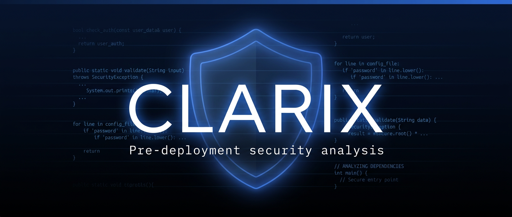

<div align="center">



# Clarix

### Pre-deployment security analysis for your codebase.
**146 regex rules + optional LLM deep review — web UI, CLI, Docker, pre-commit.**

<br/>

[](LICENSE)
[](https://github.com/aengelicc/clarix/releases)
[](../../actions/workflows/ci.yml)
[](https://www.python.org/downloads/)
[](https://nodejs.org)
[](https://github.com/astral-sh/ruff)
[](https://pre-commit.com)

[**Quick Start**](#-quick-start) · [**Web UI**](#-web-ui) · [**CLI**](#-cli) · [**Docker**](#-docker) · [**Pre-commit**](#-pre-commit-hook) · [**Rules**](#-rules) · [**Contributing**](#-contributing)

</div>

---

## Why Clarix?

Most security scanners fall into one of three traps: **too slow** (full SAST suites), **too noisy** (thousands of low-signal findings), or **too trusting** (uploads your code to a third-party SaaS).

Clarix is built for the *right before I push* moment:

- **146 built-in rules** out of the box — Security, HIPAA, PCI-DSS, GDPR, SOC 2, OWASP Top 10 (2021), CIS Critical Security Controls v8.
- **Static-first** — the regex engine needs no API key. Add LLM review only when you want richer findings.
- **Runs everywhere** — web UI, CLI, Docker, or pre-commit hook. Same rules, same reports.
- **SARIF-native** — drop results straight into GitHub Code Scanning.

---

## Features

| | |
|---|---|
| 🛡️ **146 built-in rules** | Security, HIPAA, PCI-DSS, GDPR, SOC 2, OWASP Top 10, CIS v8 — no API key required. |
| 🤖 **LLM deep review** *(optional)* | AI-powered context analysis via Anthropic Claude or OpenAI GPT-4o. |
| 🌐 **GitHub + local** | Paste a repo URL or browse a local folder. Public or private repos. |
| ⚙️ **Rules manager** | Enable, disable, edit, add, or bulk-toggle rules from the UI. |
| 📡 **Live streaming** | Findings stream in real time over SSE as files are scanned. |
| 📤 **Multi-format export** | Markdown, JSON, or SARIF 2.1.0 (GitHub Code Scanning compatible). |
| 🔌 **CI-friendly exit codes** | `0` clean · `1` findings · `2` usage error · `3` scan error. |
| 🐳 **Docker ready** | `docker-compose up` for production. Dual-mode image: API or CLI. |

---

## 🚀 Quick Start

### Prerequisites
- **Python 3.11+**
- **Node.js 18+**

### 1. Clone
```bash
git clone https://github.com/aengelicc/clarix.git
cd clarix
```

### 2. Backend
```bash
cd backend
python -m venv venv
source venv/bin/activate   # Windows: venv\Scripts\activate
pip install -r requirements.txt
cp .env.example .env
```

Edit `.env` (only required for LLM analysis — static-only mode needs no keys):
```env
LLM_PROVIDER=anthropic          # or openai
ANTHROPIC_API_KEY=sk-ant-...
OPENAI_API_KEY=sk-...
GITHUB_PAT=ghp_...              # only for private repos
```

Start it:
```bash
uvicorn app.main:app --reload --port 8000
```

### 3. Frontend
```bash
cd ../frontend
npm install
npm run dev
```

Open **http://localhost:5173** — the dev server proxies API calls to `:8000` automatically.

---

## 🖥️ Web UI

1. Paste a GitHub URL or click **Browse** to pick a local folder.
2. *(Optional)* Open **Analysis Settings** to pick an LLM provider, or toggle **Static analysis only** to skip LLM calls entirely.
3. Click **Start Analysis**.

Results stream in across five tabs: **Overview · Issues · Files · Compliance · AI Insights**. The Compliance tab has separate views for HIPAA, PCI-DSS, GDPR, SOC 2, OWASP Top 10, and CIS Controls v8.

---

## ⌨️ CLI

Install from a local checkout:
```bash
pip install -e .
clarix scan ./src --format sarif --severity-threshold high --output results.sarif

# Or without installing
python -m clarix_cli scan ./src --format text

# List rules (filterable by scanner)
clarix rules --scanner owasp
```

| | |
|---|---|
| **Subcommands** | `scan`, `rules`, `version` |
| **Output formats** | `text`, `json`, `sarif` |
| **Exit codes** | `0` clean · `1` findings at/above threshold · `2` usage error · `3` scan error |

---

## 🐳 Docker

Production in one command:
```bash
cp backend/.env.example backend/.env  # add your keys
docker-compose up --build
```

| Service  | URL                    |
|----------|------------------------|
| Frontend | http://localhost:3000  |
| Backend  | http://localhost:8000  |

The image is **dual-mode**: `clarix` runs the API by default; `clarix scan|rules|version` runs the CLI.

### One-shot CLI via Docker
```bash
# SARIF report from a local folder
docker run --rm -v $(pwd):/src aengelicc/clarix scan /src --format sarif --output /src/scan.sarif

# List built-in rules for the OWASP scanner
docker run --rm aengelicc/clarix rules --scanner owasp
```

---

## 🪝 Pre-commit hook

Add to your project's `.pre-commit-config.yaml`:
```yaml
repos:
  - repo: https://github.com/aengelicc/clarix
    rev: v1.0.0
    hooks:
      - id: clarix-scan
        args: ['--severity-threshold', 'low', '--fail-on', 'high']
```

Requires the `clarix` CLI on `PATH` (or override `language` / `additional_dependencies` in your hook config).

---

## ⚙️ Configuration

All backend config lives in `backend/.env`:

| Variable             | Default                    | Description                              |
|----------------------|----------------------------|------------------------------------------|
| `LLM_PROVIDER`       | `anthropic`                | `anthropic` or `openai`                  |
| `ANTHROPIC_API_KEY`  | —                          | Required for LLM analysis with Claude    |
| `ANTHROPIC_MODEL`    | `claude-sonnet-4-6`        | Claude model ID                          |
| `OPENAI_API_KEY`     | —                          | Required for LLM analysis with GPT       |
| `OPENAI_MODEL`       | `gpt-4o`                   | OpenAI model ID                          |
| `GITHUB_PAT`         | —                          | Personal access token for private repos  |
| `MAX_FILES`          | `100`                      | Maximum files to scan per analysis       |
| `MAX_FILE_SIZE_KB`   | `500`                      | Skip files larger than this              |

---

## 🛡️ Rules

Clarix ships with **146 built-in rules** spanning Security, HIPAA, PCI-DSS, GDPR, SOC 2, OWASP Top 10 (2021), and CIS Critical Security Controls v8.

Open **Manage security rules** from the home screen to:

- ✅ **Enable / disable** individual rules, or bulk-toggle all on/off
- ✏️ **Edit** any rule's pattern, severity, or description
- ➕ **Add** custom regex rules scoped to a specific scanner and language
- 🗑️ **Delete** rules you don't need

Rules are persisted in `backend/app/data/rules.json` and survive restarts.

---

## 🗂️ Project Structure

```
clarix/
├── backend/
│   ├── app/
│   │   ├── api/           # REST + SSE endpoints
│   │   ├── core/          # Pydantic models & config
│   │   ├── data/          # rules.json (seeded on first run)
│   │   └── services/      # Ingestion, LLM, scanners, rules store
│   ├── clarix_cli/        # `clarix scan|rules|version` entrypoint
│   ├── tests/
│   ├── requirements.txt
│   └── .env.example
│
└── frontend/
    ├── src/
    │   ├── components/    # Dashboard, RulesManager, InputForm, …
    │   └── hooks/         # useAnalysis, useRules
    └── package.json
```

---

## 🤝 Contributing

PRs welcome. The codebase is ~85% typed, ruff-enforced, and mypy-checked in CI.

```bash
# Backend dev setup
cd backend
pip install -r requirements.txt
pip install -e ".[dev]"
pre-commit install
pre-commit run --all-files
pytest -v
```

Please open an issue before non-trivial changes — happy to discuss the design first.

---

## 📄 License

[MIT](LICENSE) © 2026 Aengelicc

---

<div align="center">
<sub>Built with 🛡️ for developers who'd rather catch secrets before deploy.</sub>
<br/><br/>
<sub>💡 Sharing the repo? Upload <code>docs/img/banner.png</code> as the social preview in <em>Settings → General → Social preview</em> (1280×640 crop).</sub>
</div>
